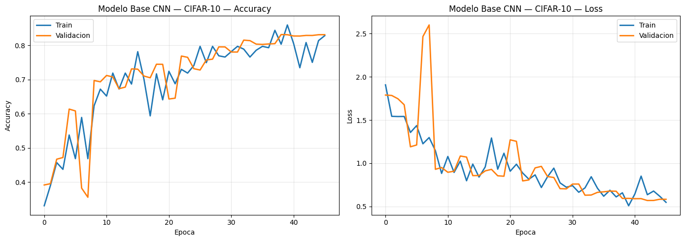
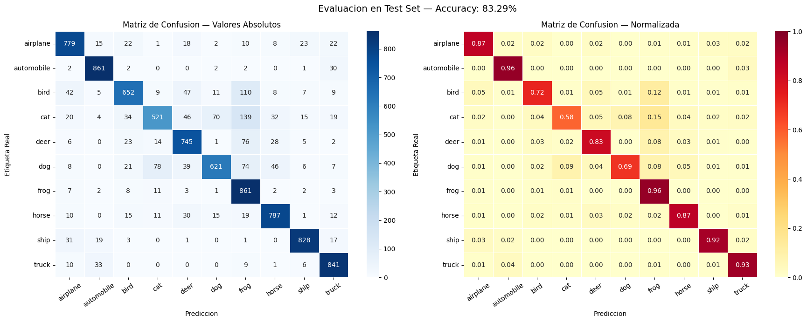
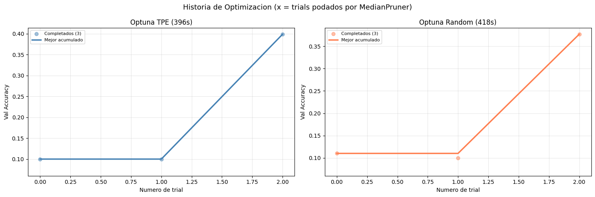

# CNN for CIFAR-10 — Image classification + hyperparameter tuning

Convolutional neural network trained on **CIFAR-10** (60,000 32×32 RGB images, 10 classes), with hyperparameter search and exported trained models.


## Results

| Metric | Value |
|--------|-------|
| **Test accuracy** | **83.29 %** |
| Test loss | 0.577 |
| Model parameters | 815,914 |
| Inference | **24.67 ms / image** |
| Dataset | CIFAR-10 (10 classes) |

**Best hyperparameters** (grid search, 8 combinations):

| Hyperparameter | Search space | Winner |
|----------------|--------------|--------|
| `filters1` (first conv block) | {32, 64} | **32** |
| `dropout1` | {0.25, 0.35} | **0.25** |
| `learning_rate` | {0.001, 0.0005} | **0.001** |

Full results in [`hyperparameter_results_cifar10.json`](hyperparameter_results_cifar10.json).

### Training curves



### Confusion matrix



### Optimization history (Optuna)

`notebook_optuna.ipynb` additionally explores the search space with **Optuna** (TPE vs Random sampler) beyond the manual grid search.



## Architecture

Sequential Keras CNN: `Conv2D → BatchNorm → MaxPooling` blocks + regularizing `Dropout` → softmax `Dense` classifier (10 classes). Data augmentation (flips, shifts, rotations) to mitigate overfitting on CIFAR-10.

## Repo structure

```
├── notebook.ipynb                      # EDA + training + evaluation (curves, confusion matrix)
├── notebook_optuna.ipynb               # Hyperparameter tuning with Optuna
├── hyperparameter_results_cifar10.json # Metrics and full grid search
├── best_cnn_cifar10.h5 / .keras        # Exported trained models
├── app.py                              # Inference with the saved model
├── assets/                             # Exported figures
├── STUDY_NOTES.md · TEORIA (1).md      # Study notes
└── requirements.txt
```

## How to run

```bash
pip install -r requirements.txt

# Retrain / reproduce
jupyter notebook notebook.ipynb

# Inference with the trained model
python app.py
```

## Stack

Python · TensorFlow/Keras · Optuna · NumPy · Matplotlib · scikit-learn (metrics)
